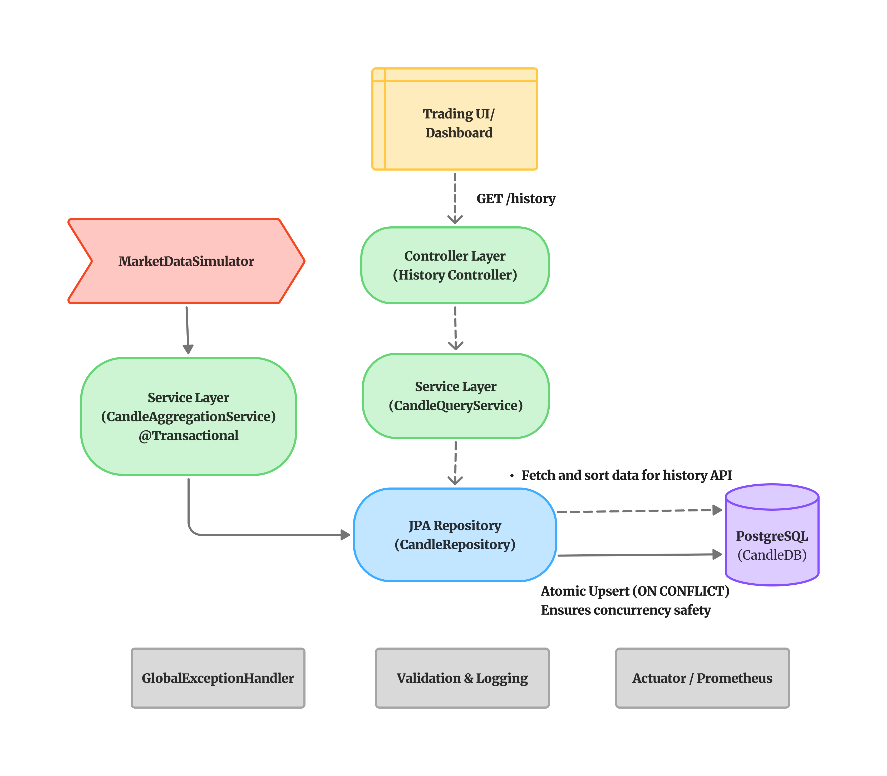

# Candle Aggregation Service

A backend Java service that ingests real-time bid/ask market data,
aggregates it into OHLC (Open, High, Low, Close) candlestick format,
and exposes historical candle data through a REST API.

The service supports multiple symbols and time intervals and is designed
to be concurrency-safe and horizontally scalable.

---

##  Project Overview

This project simulates a real-time trading backend system.

It performs the following:

- Ingests bid/ask market data events
- Aggregates events into time-bucketed OHLC candles
- Stores candles in PostgreSQL
- Provides historical data via REST API
- Ensures concurrency safety using atomic database upserts
- Exposes metrics via Prometheus endpoint

The system separates **read (query)** and **write (aggregation)** paths
for clarity and scalability.
---

## Architecture


Key architectural highlights:

- Stateless service layer
- Atomic `ON CONFLICT` upsert for concurrency safety
- Unique constraint on `(symbol, interval, bucket_time)`
- Clean separation of controller, service, repository layers
- Prometheus metrics exposure
---
## Tech Stack

- **Java 21**
- **Spring Boot 4.0.3**
- **Spring Data JPA**
- **PostgreSQL**
- **HikariCP**
- **Micrometer**
- **Prometheus**
- **JUnit 5**
- **Mockito**
- **Maven**

---

## Functional Features

- Real-time simulated market data ingestion
- Multi-interval candle aggregation (1s, 5s, 1m, etc.)
- Historical candle REST API
- Atomic database upsert
- Request validation and global exception handling
- Prometheus metrics endpoint

---

##  Assumptions & Trade-Offs

**Assumptions**
- Events are validated defensively.
- PostgreSQL is the source of truth.
- Stateless design enables horizontal scaling.
- Atomic upsert ensures safe concurrency.

**Trade-Offs**
- PostgreSQL-specific implementation (`ON CONFLICT`).
- No caching layer (POC simplicity).
- Simulated ingestion instead of Kafka.
- Security and secret management simplified (credentials stored in local config for POC).

---

## Running the Application

### 1. Start PostgreSQL

Make sure PostgreSQL is running and configured in `application.yml`.

Example:

```yaml
spring:
  datasource:
    url: jdbc:postgresql://localhost:5432/candledb
    username: your_user
    password: your_password
 ```

### 2. Build the Project

```yaml
mvn clean install
 ```
### 3. Run the Application
```yaml
mvn spring-boot:run
 ```
Or run from IDE.

### 4. Access Endpoints

- History API :
    ```yaml
    GET http://localhost:8080/history?symbol=BTC-USD&interval=1s&from=0&to=9999999999
    ```

- Actuator :
    ```yaml
    http://localhost:8080/actuator
    ```
- Prometheus Metrics :
    ```yaml
    http://localhost:8080/actuator/prometheus
    ```
---

## Running Tests

Tests use an H2 in-memory database via `application-test.yml`.

Run tests:
```yaml
mvn test
```

Test coverage includes:

- Aggregation logic
- Repository behavior
- Query service
- Controller layer

---

## Observability

- Spring Boot Actuator enabled
- Prometheus endpoint exposed
- JVM, HTTP, and DB metrics available
- Structured logging implemented

---

## Bonus Features Implemented

- Atomic PostgreSQL upsert (ON CONFLICT)
- Defensive validation and null safety
- Global exception handling
- Prometheus metrics integration
- Clean layered architecture
- Unit & integration tests

---

## Possible Future Improvements
- Kafka-based ingestion
- Redis caching
- Time-series optimization (TimescaleDB / partitioning)
- API authentication & security hardening
- Secure secret management (Vault / cloud secret store)
- Containerized deployment (Docker/Kubernetes)

---

##  Author

**Bijaya Bhaskar Swain**  
Java • Spring Boot • Microservices • Cloud